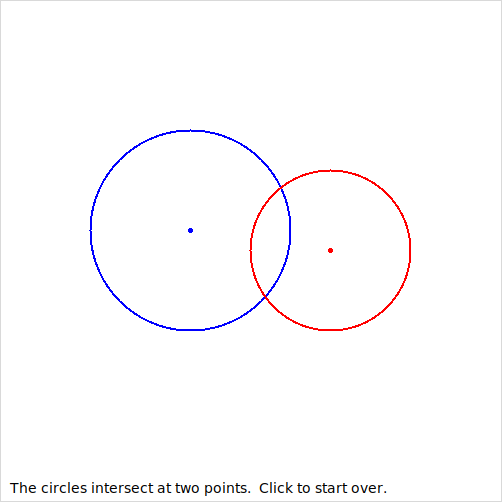

# Python Projects

[](https://github.com/mariarbelen/pythonproj/actions/workflows/ci.yml)

Python programs from my **CS3C** coursework: an interactive geometry visualizer and an email automation tool. Both are covered by automated tests (pytest) and lint checks (ruff) that run on every push via GitHub Actions.

## 🔵 Circle Intersection Visualizer

[`circles/circle_intersection.py`](circles/circle_intersection.py)

Click to draw two circles and the program tells you how they relate: separate, touching on the outside or inside, intersecting at two points, one inside the other, or identical.



- Interactive GUI built with **Tkinter** using mouse-event handlers
- Geometry logic kept separate from the GUI in a pure `classify_circles()` function so it can be unit-tested
- Tolerance-based comparisons, since mouse clicks land on whole pixels

```bash
python circles/circle_intersection.py
```

## ✉️ Exam Score Notifier

[`score_notifier/score_notifier.py`](score_notifier/score_notifier.py) *(pair-programmed with George Lam)*

Emails each student their exam score with personalized feedback. Students scoring 50 or below are pointed to the tutoring center, and students scoring 90 or above get a gold star. Students are read from a CSV file or typed in by hand.

- Builds emails with the standard library's `email` package and sends them over **SMTP with STARTTLS**
- **Preview mode by default**, so nothing is sent unless you pass `--send`
- Credentials come from environment variables, never from the code
- Validates email addresses and scores, and skips bad CSV rows with a clear message

```bash
python score_notifier/score_notifier.py score_notifier/students.csv
```

```
Skipping line 5: invalid email address: 'not-an-email'
--------------------------------------------------
To:      ana.lopez@example.com
Subject: Your exam score

Your score on the last exam is 95.

Fantastic job! Keep it up.
--------------------------------------------------
...
3 email(s) previewed. Run with --send to send them.
```

To send for real, set your SMTP details and add `--send`. For Gmail, use an [app password](https://support.google.com/accounts/answer/185833).

```bash
export SMTP_SENDER="you@gmail.com"      # also used as the login username
export SMTP_HOST="smtp.gmail.com"       # default
export SMTP_PORT="587"                  # default
python score_notifier/score_notifier.py score_notifier/students.csv --send
```

You'll be prompted for the password, or you can set `SMTP_PASSWORD`. To attach images, add `tutoring.jpg` and `goldstar.jpg` to `score_notifier/images/`.

## Running the Tests

Requires Python 3.10+.

```bash
pip install -r requirements-dev.txt
pytest          # 28 unit tests
ruff check .    # lint
```

The tests cover every circle relationship, including tangent and edge cases, as well as score thresholds, input validation, email contents and attachments. They also check that preview mode never connects to a mail server and that sending uses STARTTLS, using a fake SMTP server.

## Author

**Maria Rodriguez**
