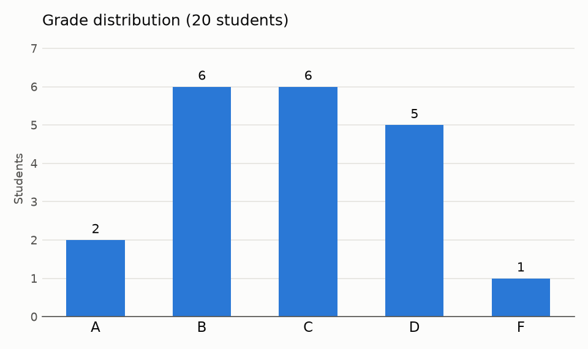

# Python Projects

[](https://github.com/mariarbelen/pythonproj/actions/workflows/ci.yml)

Python projects covering data analysis, GUI programming and email automation. All three are covered by automated tests (pytest) and lint checks (ruff) that run on every push via GitHub Actions.

| Project | What it does | Tools |
|---|---|---|
| [Grade Analyzer](#-grade-analyzer) | Weighted grades, class statistics and a distribution chart from a gradebook CSV | pandas, matplotlib |
| [Circle Intersection Visualizer](#-circle-intersection-visualizer) | Click to draw two circles and see how they relate | Tkinter |
| [Exam Score Notifier](#%EF%B8%8F-exam-score-notifier) | Emails students their scores with personalized feedback | smtplib, email |

## 📊 Grade Analyzer

[`grade_analyzer/grade_analyzer.py`](grade_analyzer/grade_analyzer.py)

Reads a class gradebook and turns it into a report for the instructor:

- Computes each student's **weighted course grade**: homework 30%, midterm 30%, final 40%. An optional `--drop-lowest` drops each student's lowest homework score.
- Assigns letter grades and **flags students who need help**: a grade under 70 or 2+ missing assignments
- Reports class statistics (mean, median, standard deviation, range) and the hardest assignment
- Saves a **grade-distribution chart**, a full `grades.csv`, and a `scores_for_notifier.csv` that the [Exam Score Notifier](#%EF%B8%8F-exam-score-notifier) reads directly, so the two tools form one workflow
- Validates the file and reports problems by line number (missing columns, non-numeric or out-of-range scores)

```bash
python grade_analyzer/grade_analyzer.py grade_analyzer/gradebook.csv
```

```
Student                HW  Midterm  Final   Grade  Letter
---------------------------------------------------------
Sam Okafor           96.0       96     85    91.6  A
Daniel Patel         92.4       91     91    91.4  A
Ben Kim              72.8      100     91    88.2  B
...
Kevin Tran           51.8       81     87    74.6  C  <- needs help
...
Quinn Murphy         62.4       39     52    51.2  F  <- needs help

Class of 20: mean 75.7, median 74.6, std dev 10.4, range 51.2-91.6
Grade distribution: A: 2, B: 6, C: 6, D: 5, F: 1
Hardest assignment: hw3 (class average 68.3)

7 student(s) may need help:
  - Kevin Tran (2 missing assignments)
  - Ana Lopez (grade 65.5, 2 missing assignments)
  ...
```



Then email every student their grade:

```bash
python score_notifier/score_notifier.py report/scores_for_notifier.csv
```

The sample gradebook uses made-up students.

## 🔵 Circle Intersection Visualizer

[`circles/circle_intersection.py`](circles/circle_intersection.py)

Click to draw two circles and the program tells you how they relate: separate, touching on the outside or inside, intersecting at two points, one inside the other, or identical.


- Interactive GUI built with **Tkinter** using mouse-event handlers
- Geometry logic kept separate from the GUI in a pure `classify_circles()` function so it can be unit-tested
- Tolerance-based comparisons, since mouse clicks land on whole pixels

```bash
python circles/circle_intersection.py
```

## ✉️ Exam Score Notifier

[`score_notifier/score_notifier.py`](score_notifier/score_notifier.py) *(pair-programmed with George Lam)*

Emails each student their exam score with personalized feedback. Students scoring 50 or below are pointed to the tutoring center, and students scoring 90 or above get a gold star. Students are read from a CSV file or typed in by hand.

- Builds emails with the standard library's `email` package and sends them over **SMTP with STARTTLS**
- **Preview mode by default**, so nothing is sent unless you pass `--send`
- Credentials come from environment variables, never from the code
- Validates email addresses and scores, and skips bad CSV rows with a clear message

```bash
python score_notifier/score_notifier.py score_notifier/students.csv
```

```
Skipping line 5: invalid email address: 'not-an-email'
--------------------------------------------------
To:      ana.lopez@example.com
Subject: Your exam score

Your score on the last exam is 95.

Fantastic job! Keep it up.
--------------------------------------------------
...
3 email(s) previewed. Run with --send to send them.
```

To send for real, set your SMTP details and add `--send`. For Gmail, use an [app password](https://support.google.com/accounts/answer/185833).

```bash
export SMTP_SENDER="you@gmail.com"      # also used as the login username
export SMTP_HOST="smtp.gmail.com"       # default
export SMTP_PORT="587"                  # default
python score_notifier/score_notifier.py score_notifier/students.csv --send
```

You'll be prompted for the password, or you can set `SMTP_PASSWORD`. To attach images, add `tutoring.jpg` and `goldstar.jpg` to `score_notifier/images/`.

## Running the Tests

Requires Python 3.10+.

```bash
pip install -r requirements.txt       # to run the programs
pip install -r requirements-dev.txt   # to also run the tests
pytest          # 49 tests
ruff check .    # lint
```

The tests cover grade math, letter cutoffs, missing work, file validation and the analyzer-to-notifier handoff. They also cover every circle relationship, including tangent and edge cases, as well as score thresholds, input validation, email contents and attachments. They also check that preview mode never connects to a mail server and that sending uses STARTTLS, using a fake SMTP server.

## Author

**Maria Rodriguez**
